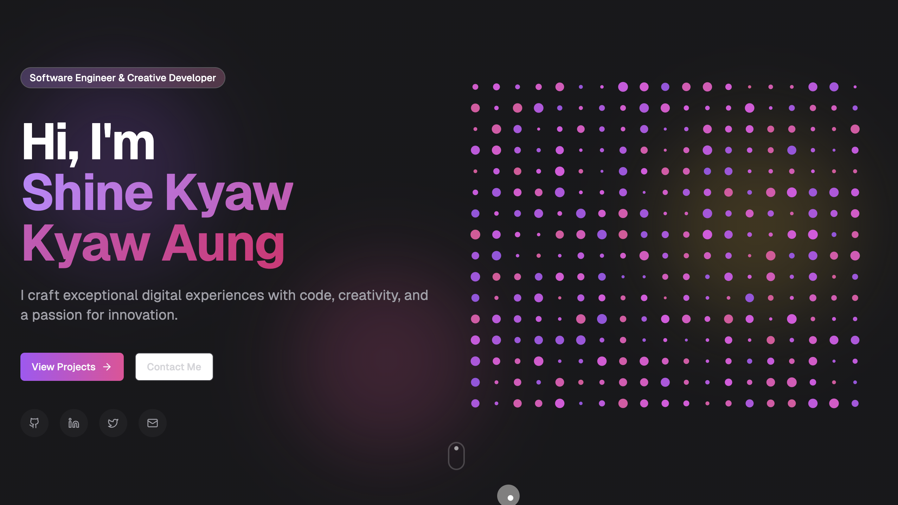

# Aniket Kumar - Personal Portfolio & Blog

A modern and responsive personal portfolio and blog website showcasing my work as a Cybersecurity Expert and Full Stack Developer.

## Live Demo

Check out the live website: [https://anidz.app](https://anidz.app)

## Features

- 🎨 Responsive design that works on all devices
- ⚡ Modern UI with smooth animations and transitions
- 📝 Dynamic blog system with Google Sheets integration
- 🛡️ Cybersecurity projects showcase
- 💼 Professional portfolio sections
- 📱 Mobile-first responsive design
- 🔍 SEO optimized with structured data
- 📊 Analytics integration
- 🎯 Contact form with email integration

## Technologies Used

- [Next.js 15](https://nextjs.org/) - The React framework for production
- [TypeScript](https://www.typescriptlang.org/) - Type-safe JavaScript
- [Tailwind CSS](https://tailwindcss.com/) - Utility-first CSS framework
- [Framer Motion](https://www.framer.com/motion/) - Production-ready motion library
- [Google Sheets API](https://developers.google.com/sheets/api) - Dynamic content management
- [Vercel](https://vercel.com) - Deployment platform

## Getting Started

To run this project locally, follow these steps:

1. Clone the repository:
   \`\`\`bash
   git clone https://github.com/AniD-z/PersonalWeb.git
   \`\`\`

2. Navigate to the project directory:
   \`\`\`bash
   cd Creative-Portfolio
   \`\`\`

3. Install dependencies:
   \`\`\`bash
   npm install
   \`\`\`

4. Run the development server:
   \`\`\`bash
   npm run dev
   \`\`\`

5. Open [http://localhost:3000](http://localhost:3000) in your browser to view the portfolio.

## Customization

To customize this portfolio for your own use:

1. Update the content in the appropriate components
2. Replace placeholder images with your own in the `public` folder
3. Modify the color scheme in `tailwind.config.js`
4. Update the metadata in `app/layout.tsx`

## Deployment

This project is configured for easy deployment on Vercel. To deploy your own version:

1. Fork this repository
2. Create a new project on Vercel
3. Connect your GitHub account and select this repository
4. Click "Deploy"

Vercel will automatically deploy your portfolio and provide you with a live URL.

## Contributing

Contributions are welcome! If you have suggestions for improvements, please open an issue or submit a pull request.

## License

This project is open source and available under the [MIT License](./LICENSE).
